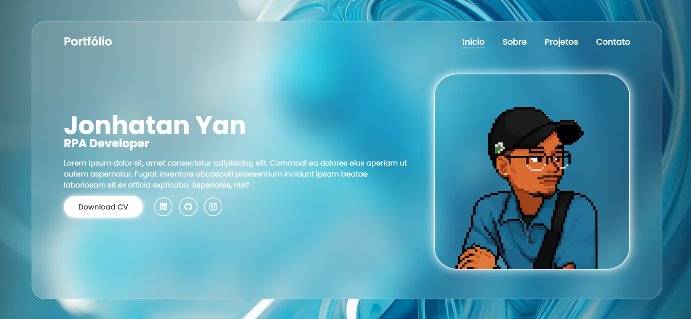

# 🚀 Projeto Desenvolvido para Estudos
> ⚠️ Este repositório é apenas para fins educativos.  
> ⚠️ This repository is for educational purposes only.

Este projeto tem caráter **educativo** e foi criado para **praticar e compreender diferentes trechos de código** em suas respectivas linguagens. O objetivo é entender **como cada método e elemento se comporta**, explorando conceitos de desenvolvimento web.

A aplicação é um **site portfólio**, onde pude aprofundar meus conhecimentos em **HTML e CSS**, com a intenção de, futuramente, aplicar **JavaScript** para tornar o site mais interativo.

---

## 🌟 Funcionalidades/ Features
- ✅ Site portfólio com seções: Sobre, Contato e Projetos  
- ✅ Botões que direcionam para redes sociais  
- 🧩 Interface simples (futuramente responsiva)

---

## 💻 Principais Linguagens / Main Languages
- HTML5  
- CSS3  

---

## 🌐 Consumo de APIs / API Usage
- Google Fonts

---

## 📁 Estrutura do Projeto / Project Structure
📂 aula-html/
┣ 🖼️ 0-background.jpg
┣ 🖼️ 1-person.png
┣ 📜 index.html
┣ 📜 style.css
┣ 📜 README.md

---

## 📚 Referências / References
Todo o conteúdo deste código foi baseado em aulas do canal **@Codehal** no YouTube.  
O projeto foi desenvolvido **passo a passo para fins educacionais**, respeitando os direitos autorais do material original.

## 🖼️ Imagem do Projeto
 Início:

